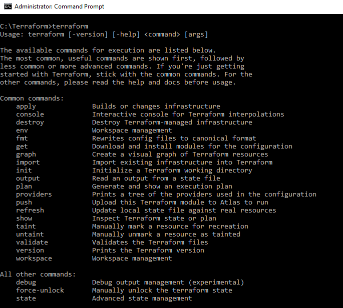

# Understanding components

Some core terraform components include:
- **Configuration Files**: Text-based configuration files allow you to define infrastructure and application configuration.
- **Modules**: Modules are self-contained packages of Terraform configurations that are managed as a group. You use modules to create reusable components in Terraform and for basic code organization. A list of available moduels for Azure is available on the [Terraform Registry Modules](https://registry.terraform.io/) webpage.
- **Provider**: The provider is responsible for understanding API interactions and exposing resources.
- **Overrides**: Overrides are a way to create configuration files taht are loaded last and merged into (rather than appended to) your configuration. You can craete overrides to modify Terraform behavior without having to edit the Terraform configuration. They can also be used as temporary modification that you can make to Terraform configurations without changing the configuration itself.
- **Resources**: Resources are sections of a configuration file taht define components of your infrastructure, such as VM's, network resources, containers, dependencies, or DNS records. The resource block creates a resource of the given *TYPE* (first parameters) and *NAME* (second parameter). However, the combination of the type and name must be unique.
- **Execution plan**: You can issue a command in the Terraform CLI to generate an execution plan. The *execution plan* shows what Terraform will do when a configuration is applied. It enables you to verify changes and potential flag issues. The command for the execution plan is `Terraform plan`.
- **Resource graph**: using a resource graph, you can build a dependency graph of all resources. You can then create and modify resources in parallel. It helps provision and configures resources more efficiently.

# Install Terraform
Go to the [Download Terraform](https://www.terraform.io/downloads) page and choose the appropriate download package for your environment.

If you download Terraform for the Windows operating system:
1. Find the install package, which is bundled as a zip file.
2. Copy files from the zip to a local directory such as C:\terraform. It's the Terraform PATH, so make sure that the Terraform binary is available on the PATH.
3. To set the PATH environment variable, run the command set PATH=%PATH%;C:\terraform, or point to wherever you've placed the Terraform executable.
4. Open an administrator command window at C:\Terraform and run the command Terraform to verify the installation. You should view the terraform help output.  

