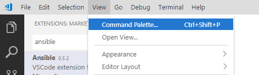
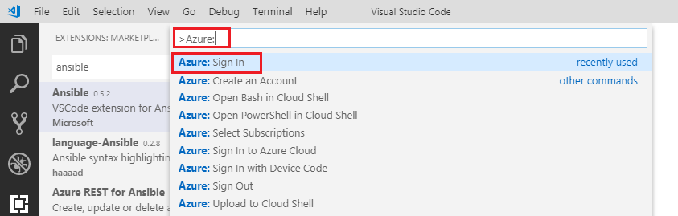

# Run Terraform in Visual Studio Code
Two Visual Studio code extensions that are required are **Azure Account**, and **Terraform**.

1. In Visual Studio Code, open the command palette by selecting View > Command Palette.<br/> 
2. In the Command Palette search field, type Azure: Select Azure: Sign In from the results.<br/> 
3. Verify that your Azure account now displays at the bottom of the Visual Studio Code window.
4. Run the following commands in this order:
```
terraform init
terraform plan
terraform apply
```