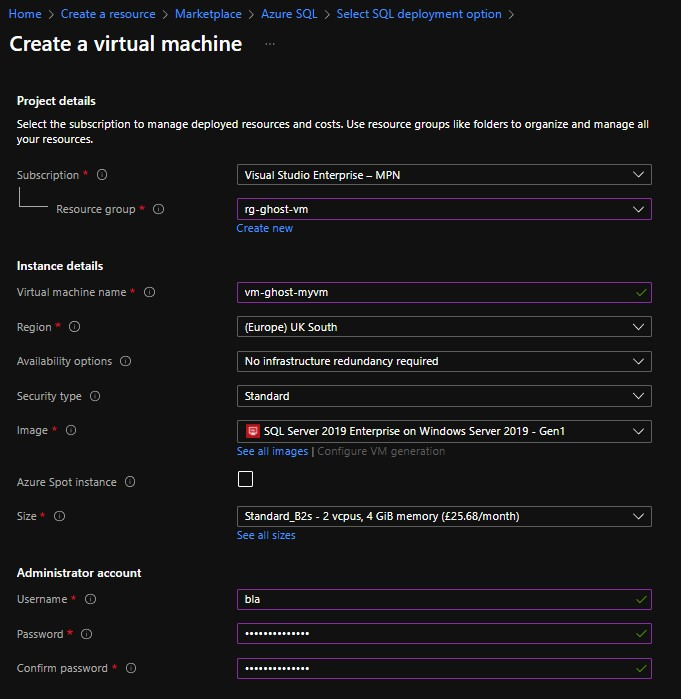
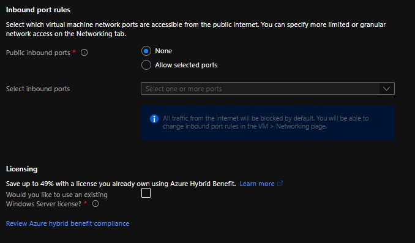
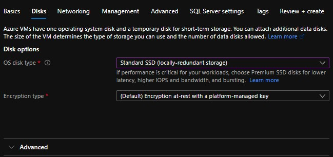
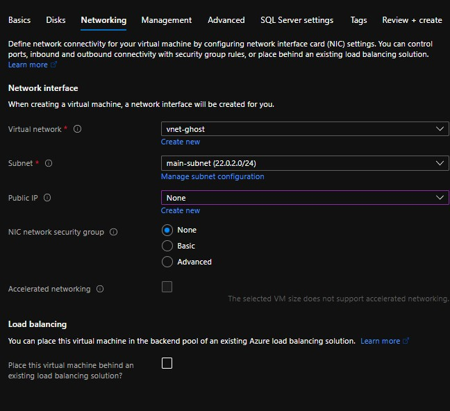

# Create a VM
You can use the [template](Resources/Template/template.json) with the [parameters](Resources/Template/parameters.json) so to skip having to setup the vm manually, or use the following screenshots:

1. Create VM
   
   
   - Select an image that has sql server installed on it already
   - Select a size with 2 cpus and 4 gigs of RAM
   - Make sure inbound public ports are turned off
2. In Disk settings select standard SSD as it's cheaper

3. Set the virtual network settings to the one setup in the [VPN Example](Configure%20a%20Point-to-Site%20VPN%20connection%20using%20Azure%20CLI.md), and make sure to turn **Public IP** off
