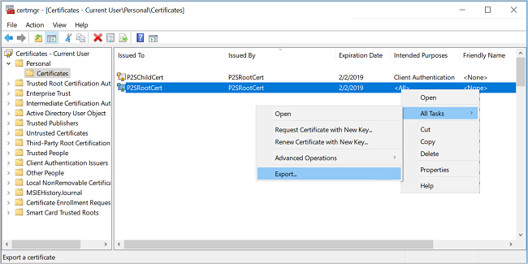
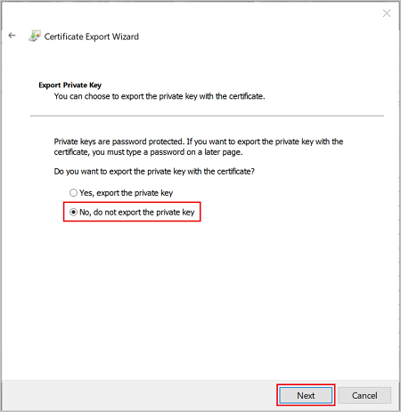
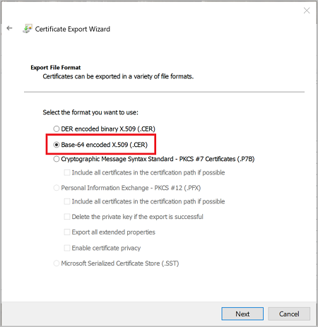
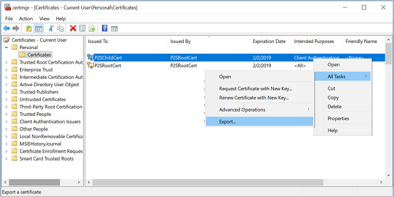
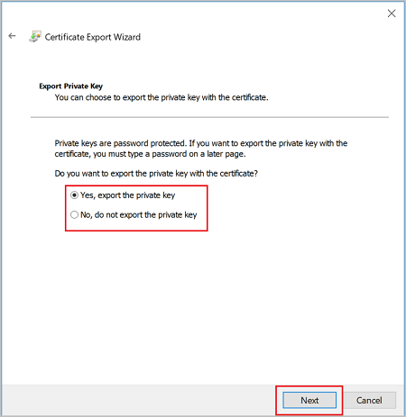
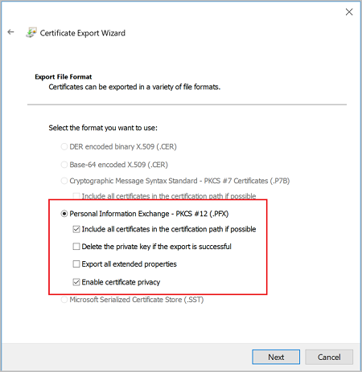
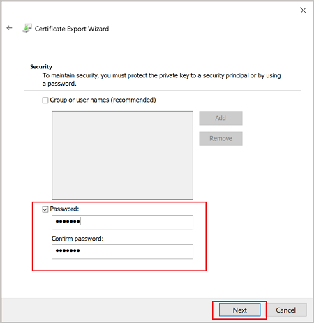

# Configure a Point-to-Site VPN connection using Azure certificate authentication: Azure portal

Point-to-site native Azure certificate authentication connections use the following items, which you configure in this exercise:

A RouteBased VPN gateway.
The public key (.cer file) for a root certificate, which is uploaded to Azure. Once the certificate is uploaded, it is considered a trusted certificate and is used for authentication.
A client certificate that is generated from the root certificate. The client certificate installed on each client computer that will connect to the VNet. This certificate is used for client authentication.
VPN client configuration. The VPN client is configured using VPN client configuration files. These files contain the necessary information for the client to connect to the VNet. The files configure the existing VPN client that is native to the operating system. Each client that connects must be configured using the settings in the configuration files.


## Create VNet
Open Azure portal and you can copy the following into `Cloud Shell` bash, or int `PowerShell` if you have Azure CLI installed.

1. Put the `Resource Group` name into a variable as you will need it a coupld of times
    ```
    rg="rg-ghost-vm"
    ```
2. Create a resource group
    ```
    az group create --location uksouth --name $rg
    ```

2. Create vnet 
First store the vnet name in a variable you will need it later
    ```
    vnet="vnet-ghost"
    ```
    Then create the vnet

    ```
    az network vnet create \
                    -g $rg \
                    -n $vnet \
                    --address-prefix 22.0.0.0/16 \
                    --subnet-name GatewaySubnet \
                    --subnet-prefix 22.0.1.0/24 
    ```

    Add another subnet
    ```
    az network vnet subnet create --address-prefix 22.0.2.0/24 \
                                --name main-subnet \
                                --vnet-name $vnet \
                                --resource-group $rg
    ```

## Create VPN Gateway
In this step, you create the virtual network gateway for your VNet. Creating a gateway can often take 45 minutes or more, depending on the selected gateway SKU.

The virtual network gateway uses specific subnet called the gateway subnet. The gateway subnet is part of the virtual network IP address range that you specify when configuring your virtual network. It contains the IP addresses that the virtual network gateway resources and services use.

1. Create public ip
    ```
    pubIp="ip-ghost-vnet"
    ```
    ```
    az network public-ip create -n $pubIp \
                                -g $rg \
                                --location uksouth
    ```

2. Create vnet Gateway
    ```
    az network vnet-gateway create \
            -n vnet-ghost-gw \
            -g $rg \
            --vnet $vnet \
            --public-ip-addresses $pubIp \
            --sku Basic \
            --location uksouth \
            --gateway-type Vpn \
            --vpn-type RouteBased \
            --no-wait
    ```
> The deployment of this can take a while.

## Generate Certificates

Certificates are used by Azure to authenticate clients connecting to a VNet over a Point-to-Site VPN connection. Once you obtain a root certificate, you upload the public key information to Azure. The root certificate is then considered 'trusted' by Azure for connection over P2S to the virtual network. You also generate client certificates from the trusted root certificate, and then install them on each client computer. The client certificate is used to authenticate the client when it initiates a connection to the VNet.

### Generate a root certificate
Use the New-SelfSignedCertificate cmdlet to create a self-signed root certificate. 

```
$cert = New-SelfSignedCertificate -Type Custom -KeySpec Signature `
-Subject "CN=P2SRootCert" -KeyExportPolicy Exportable `
-HashAlgorithm sha256 -KeyLength 2048 `
-CertStoreLocation "Cert:\CurrentUser\My" -KeyUsageProperty Sign -KeyUsage CertSign
```

> NOTE: Keep the powershell window open after you've ran this command

### Generate a client certificate
Each client computer that connects to a VNet using Point-to-Site must have a client certificate installed. You generate a client certificate from the self-signed root certificate, and then export and install the client certificate. If the client certificate is not installed, authentication fails.

The following steps walk you through generating a client certificate from a self-signed root certificate.

```
New-SelfSignedCertificate -Type Custom -DnsName P2SChildCert -KeySpec Signature `
-Subject "CN=P2SChildCert" -KeyExportPolicy Exportable `
-HashAlgorithm sha256 -KeyLength 2048 `
-CertStoreLocation "Cert:\CurrentUser\My" `
-Signer $cert -TextExtension @("2.5.29.37={text}1.3.6.1.5.5.7.3.2")
```

### Export the root certificate public key (.cer)
After creating a self-signed root certificate, export the root certificate public key .cer file (not the private key). You will later upload this file to Azure. The following steps help you export the .cer file for your self-signed root certificate:

Locate the self-signed root certificate, typically in `Certificates - Current User\Personal\Certificates`, and right-click. Click All Tasks, and then click **Export**. 


Do not export the private key: \

> NOTE: Only export the private key if you want to store and reuse the root certificate later on another computer to create more child certificates
> 
On the **Export File Format** page, select **Base-64 encoded X.509 (.CER).**, and then click **Next**.


### Export the client certificate 
To export a client certificate, open Manage user certificates. The client certificates that you generated are, by default, located in `Certificates - Current User\Personal\Certificates`. Right-click the client certificate that you want to export, click all tasks, and then click Export to open the Certificate Export Wizard.


In this case export the private key as well


On the **Export File Format** page, leave the defaults selected. Make sure that **Include all certificates in the certification path if possible** is selected. \


On the **Security** page, you must protect the private key. If you select to use a password, make sure to record or remember the password that you set for this certificate. Then, click **Next**.


## Add the VPN client address pool
The client address pool is a range of private IP addresses that you specify. The clients that connect over a Point-to-Site VPN dynamically receive an IP address from this range. Use a private IP address range that does not overlap with the on-premises location that you connect from, or the VNet that you want to connect to. If you configure multiple protocols and SSTP is one of the protocols, then the configured address pool is split between the configured protocols equally.

```
az network vnet-gateway update \
            --address-prefixes 22.1.0.0/24 \
            --client-protocol SSTP \
            --name vnet-ghost-gw \
            --resource-group $rg
```

## Upload the root certificate public key information
You'll have to do this through powershell. Upload the root certificate to the gateway:
```
az network vnet-gateway root-cert create -g rg-ghost-vm -n P2SRootCert –-gateway-name vnet-ghost-gw –-public-cert-data C:\Temp\rootcertificate.cer
```

## Configure the VPN client:
Last step is to connect to a VNet by using a Point-to-Site VPN, each client must install a package to configure the native Windows VPN client. The configuration package configures the native Windows VPN client with the settings necessary to connect to the virtual network.

to download VPN client, type following:
```
az network vnet-gateway vpn-client generate -g $rg -n vnet-ghost-gw --processor-architecture Amd64
```

The result will be a url which allows you to download the vpn client