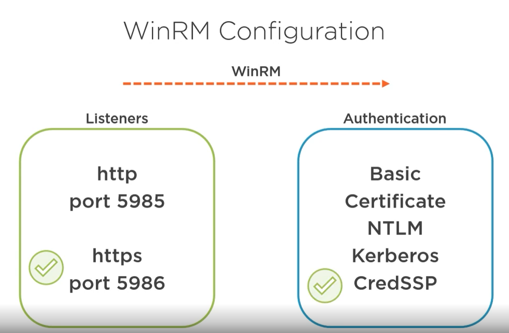

# Ansible Concepts and installing 

Ansible is a `desired state` based system. The scrips and commands are declarative. You tell ansible what state you want the system in but not how to get it in that state. Ansible will take care of that.

Ansible is `Agent-less` which makes configuring target computers a lot more simpler. Other tools require you to setup some form of agent that will accept some special commands. Ansible uses the native language of what ever OS the target is running to issue commands. On Linux it use `SSL` on Windows it uses `WinRM`. Not having to install an agent on every host machine you want on the host machine, makes introduction of Ansible much simpler.


# Installing ansible 

> NOTE: Ansible is only available in Linux. The next demonstration will show how to install Ansible on an Ubuntu that is run in a WSL.

## Setup Ansible on the controller node

### Prerequisites
 - Latest Windows 10
 - WSL with Ubuntu installed

1. Login open WSL and login into Ubuntu
2. Update the package manifest with 
```
sudo apt-get update
```

3. Install the pip tool
```
sudo apt-get install python3-pip -y
```

4. Now that pip is installed we can install ansible and the auxiliary modules that are required to work with Windows.

```
sudo pip3 install ansible
```

5. Once installed you can check the ansible version to ensure it runs properly
```
ansible --version
```

6. We need to install a couple of python modules with `pip` to ensure it communicates with windows securely

    6.1. First install winrm 
    ```
    sudo pip3 install pywinrm
    ```
    6.2. Then we need to install an additional winrm helper `pywinrm credssp` which is the authentication protocol we use for winrm
    ```
    sudo pip3 install pywinrm[credssp]
    ```

## Setup ansible on the target machine

Ansible needs to know which user to authenticate as. 

- Create an Active Directory Ansible service user
- Not recommended to use the domain administrator account

1. Create a user in the domain controller
2. Add user to the local administrators group on the server.

### Prerequisites
- Supported versions of Windows Server: 2008, 2008 R2, 2012, 2012 R2, 2016, 2019
- Powershell >= 3.0
- .Net Framework >= 4.0

For each target hosts this needs to be done once.

We are going to be using `WinRM` `Listener` on port 5986 over https so that it is secured using TLS, and `authenticate` using `CredSSP`.

`CredSSP` is a modern authentication system that uses a double hot authentication system. The username and password are only set to the target host once a secure and encrypted connection is established. `CredSSP` also works on both AD and free standing Windows local accounts.



1. Login to the machine and open PS with administrator privileges.
2. First lets see what listeners are currently running by executing the following command
```
winrm enumerate winrm/config/Listener
```
3. Check the currently configured authentication methods
```
winrm get winrm/config/Service
```
4. Ansible has provided a handy powershell script file so that we can reconfigure `WinRM` with the parameters we want. You can download that file by running this command:

```
wget https://raw.githubusercontent.com/ansible/ansible/devel/examples/scripts/ConfigureRemotingForAnsible.ps1 -OutFile ConfigureRemotingForAnsible.ps1
```

5. Now we can use this script to pass in the parameters that we want.
```
.\ConfigureRemotingForAnsible.ps1 -EnableCredSSP -DisableBasicAuth -Verbose
```

6. Verify that the changes have been made by re-running the commands in step 2. and 3.

7. Restart the `WinRM` service for good measure
```
restart-service winrm
```
