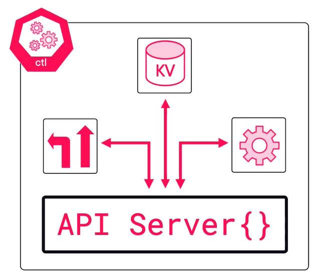

# Kubernetes architecture

## Control Node

Control nodes should be highly available and ideally have an odd number of instances

All control nodes have the following components

### Api Server
- Gateway to the cluster
- This is what we are interacting with
- This is a rest api and consumes JSON and YAML

### Cluster store
- It is an etcd NoSQL database.
- Stores the config and state
- This could be a bottleneck on larger systems
- When the above is an issue it is possible to break it out to be separate

### Controller manager
- There are different controllers in the controller (nodes, deployment, endpoint, namespace)
- Each controller is running a reconciliation loop for the bits its responsible for & is looking for changes, to make sure the observed state matches the desired state

### Scheduler
- Watches the api server for work
- assigns tasks for worker nodes

## Worker Node

This consists `pods` that are consisting of one or more containers.\
Contains the following components

### Kubelet
- Is the main Kubernetes agent that runs on each node (Worker, controller)
- Registers node with cluster
- Watches API server for work
- Reports back to the controller

### Container runtime
- Is responsible for running pods and containers
- Pluggable (CRI)
- Low level container work (how to run containers etc)

### Kube-Proxy
- Node networking
- Pod IP addresses (each pod has its own IP)
  - Containers within the pod will share that IP
- Lightweight load balancing

## Pods
Each container lives in a pod. You can also run multiple containers in a single pod (Multi-container pods).

A pod is a thin wrapper that every container needs. Its a shared execution environment. It has its own, IP, port, memory etc. Containers in the same pod will have to use unique ports. They can communicate with each other via localhost.

Running multiple containers in the same pod is a specialist case.

Scaling on Kubernetes is on the pod level. When scaling up a new pod will be created with the same containers in it. Pod deployment is an Atomic operation to a single node. Its only ready once all the containers are running.

Pods also let kubernetes do accounting and management stuff. They help with annotating, adding labels, policies, scheduling.

### Networking and services
When pods die and new pods get created it will be a brand new pod and just it behaves like the previous one, however by default new pods get created with new IP's.

Kubernetes services has a stable name and IP list and does load balancing.

The way a pod belongs to a service is with `Labels` (ie. Prod, be, 1.3 example above ).

Services:
- Only send traffic to healthy pods
- Can be used to do session affinity
- Can send traffic outside of the cluster
- Can do TCP and UDP